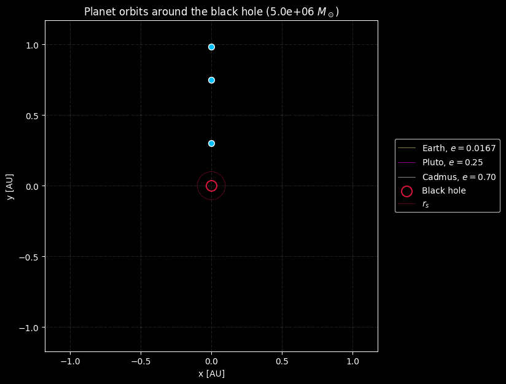

# Computational Physics II

Work done for the elective course of Computational Physics II under prof. Wladimir Banda-Barragán at Yachay Tech during the first semester of 2025.

  

Briefly speaking, it covered ODE and PDE numerical solving applied to physics problems such as population dynamics, gravitation, diffusion processes and quantum mechanics. Supercomputing and parallelization were also introduced because some problems required the use of such facilities and techniques.

I'm happy with the final results. It was fun.
